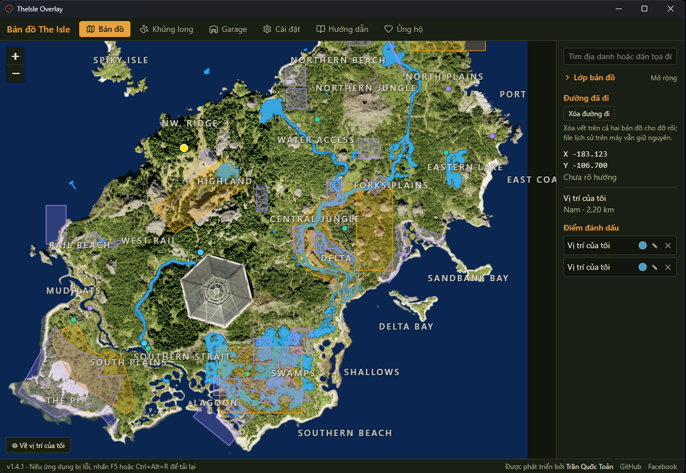
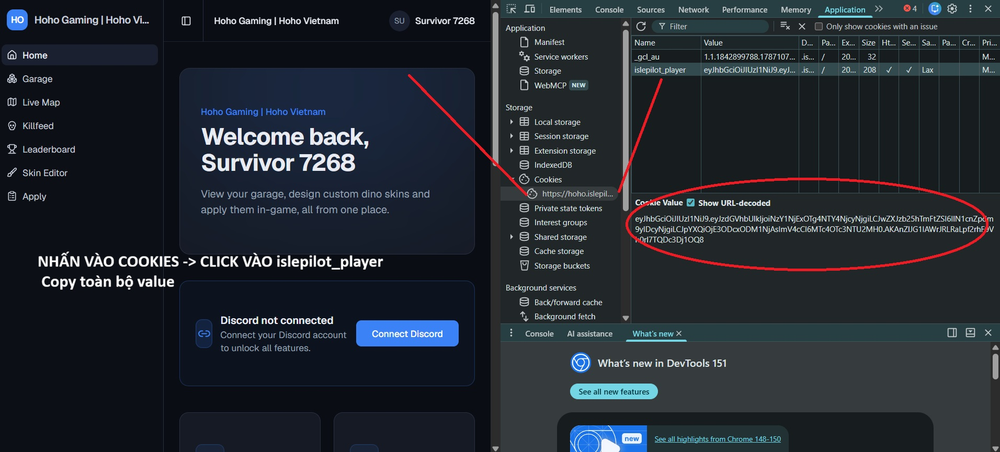
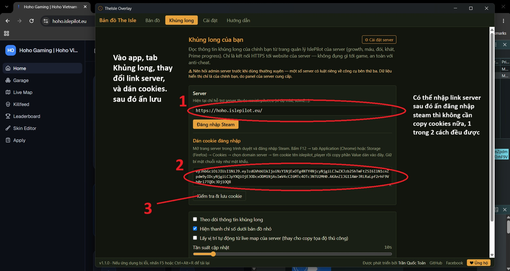

# TheIsle Overlay

**Tiếng Việt** · [English](README.en.md)

Overlay bản đồ cho **The Isle: Evrima** (map Gateway) — **do BumBum phát triển**.
Bản viết lại toàn diện: lõi Rust + Tauri gọn nhẹ (~4 MB file cài), CPU lúc chơi
gần như bằng 0, và nhiều tính năng riêng không có ở bản gốc.

- **Bản đồ nhỏ** hình tròn bám cửa sổ game, chuột bấm xuyên qua — không cản trở lúc chơi.
- **Bản đồ lớn** với POI, tên địa danh, waypoint, đường đã đi, và **xem lại hành trình** có thanh tua.
- **Khủng long của bạn** (growth, máu/đói/khát/thể lực, dinh dưỡng, Prime) + **Garage** xem 3D + **trình chỉnh skin** xuất mã dán thẳng vào game — qua IslePilot, đăng nhập Steam **một lần cho mọi server**.
- **Màn hình phụ** cho monitor thứ hai · giao diện song ngữ Việt/Anh · cài một lần, tự cập nhật.

## Mục lục

- [Tính năng](#tính-năng)
- [Cài đặt](#cài-đặt)
- [Kết nối "Khủng long của bạn" (IslePilot)](#kết-nối-khủng-long-của-bạn-islepilot)
- [Vị trí tự động & Npcap](#vị-trí-tự-động--npcap)
- [Gói PRO / PRO VIP](#gói-pro--pro-vip)
- [An toàn với anti-cheat](#an-toàn-với-anti-cheat)
- [Lưu ý & sự cố thường gặp](#lưu-ý--sự-cố-thường-gặp)
- [Nhẹ cỡ nào?](#nhẹ-cỡ-nào)
- [Nguồn dữ liệu & giấy phép](#nguồn-dữ-liệu--giấy-phép)
- [Liên hệ & Ủng hộ](#liên-hệ--ủng-hộ)

## Tính năng

**Bản đồ**

- **Bản đồ nhỏ tròn** bám góc cửa sổ game, chuột bấm xuyên qua, chỉ hiện khi bạn
  đang trong game. Hướng Bắc luôn ở trên (có thể bật xoay theo hướng đi), mũi tên
  chỉ hướng đang đi, và mũi tên rìa đĩa chỉ tới waypoint gần nhất.
- **Bản đồ lớn**: phóng to/thu nhỏ mượt, ~12 lớp bật/tắt được (nước ngọt, nguồn
  nước, mỏ muối, vũng bùn, khu bảo tồn, vùng di cư, tuần tra AI, khu thức ăn,
  động vật với biểu tượng riêng từng loài 🐗🦌🐢, tên vùng, địa điểm, và lớp
  **POI server** sống từ IslePilot). Tên địa danh hiện thẳng trên bản đồ; danh
  sách lớp thu gọn được; có nút xóa đường đi cho đỡ rối giữa trận.
- **3 kiểu nền bản đồ**: ảnh chụp Vulnona (mặc định) hoặc bản vẽ tay
  [IsleMaps](https://www.islemaps.com/) sáng/tối (**PRO**) — áp dụng cho cả hai
  bản đồ. Nền IsleMaps vẽ theo phiên bản game mới hơn, thấy cả quần đảo đông nam
  (Hell's Mouth).
- **Điểm đánh dấu (waypoint)**: chuột phải để cắm, đổi tên/màu, xóa, biểu tượng
  nhanh (💀 chỗ chết, 🏠 hang…). Nhập/xuất được.
- **Tìm kiếm & điều hướng**: tìm địa danh/waypoint theo tên, dán tọa độ để nhảy
  tới, chế độ bám vị trí với mũi tên mép màn hình dẫn về chỗ đứng.
- **Đường đã đi & xem lại hành trình**: tự ghi theo phiên; tua lại vị trí + chỉ
  số theo thời gian; khôi phục đường đi phiên trước; xuất ra file `.geojson`.

**Khủng long của bạn (IslePilot)**

- Growth, máu, đói, khát, thể lực, dinh dưỡng Carb/Đạm/Béo và tiến độ Prime (đã
  dịch tiếng Việt). Thanh chỉ số + bảng nhiệm vụ Prime gọn ngay dưới bản đồ nhỏ.
- **Đăng nhập Steam một lần dùng cho mọi server IslePilot** — đổi server trong
  game là dữ liệu tự đổi theo.
- **Cập nhật thời gian thực (WebSocket)**, lịch sử chỉ số (biểu đồ growth/đói/
  khát + ước tính thời gian cạn), đồng hồ hard-swap, và **Nhóm sinh tồn** (chia
  mã 6 ký tự để thấy nhau trên bản đồ ở mọi server).
- **Garage (Gacha) xem 3D**: mỗi dino đã park là một card có model 3D
  xoay/phóng được, đúng màu skin, kèm growth và nút Park/Restore/Đổi tên/Bán/
  Giết. Model cache lại, mở tức thì và offline được.
- **Trình chỉnh skin**: 10 kênh màu + hoa văn, xem trước trên model 3D theo thời
  gian thực, lưu preset, xuất **mã skin dán thẳng vào game**, và (**PRO**) áp
  trực tiếp lên dino đang chơi.

**Tiện ích**

- **Màn hình phụ (companion)** (**PRO**): cửa sổ dashboard riêng cho monitor thứ
  hai — chỉ số, bản đồ, đội nhóm, nhiệm vụ; nhớ vị trí/kích thước, có chế độ thu
  gọn.
- **Cài đặt** chia tab, có ô tìm kiếm. **Phím tắt toàn cục** đổi được trong app.
  Song ngữ Việt/Anh. Tự cập nhật phiên bản mới.
- **Chế độ nhẹ** cho máy CPU yếu (giới hạn khung hình, tắt bớt hiệu ứng).

## Cài đặt

1. Tải `TheIsle Overlay_x.x.x_x64-setup.exe` từ
   [Releases](https://github.com/tnqaquocanh-vn/theisle-overlay/releases) và chạy.
2. Lần đầu mở app sẽ tải dữ liệu bản đồ (~3 MB) rồi chạy trình hướng dẫn cài đặt nhanh.
3. Chạy game ở chế độ **Cửa sổ** hoặc **Toàn màn hình không viền** (overlay không
   hiện đè lên Toàn màn hình độc quyền).

Yêu cầu: **Windows 10/11 64-bit**, WebView2 (thường có sẵn trên Windows 11; nếu
thiếu, installer tự tải).

> Windows có thể hiện cảnh báo **SmartScreen** ở lần cài đầu vì installer chưa ký
> số. Bấm **More info → Run anyway**. Bản cập nhật tự động về sau không bị hỏi lại.

## Kết nối "Khủng long của bạn" (IslePilot)

Tab **Khủng long** đọc chỉ số dino của chính bạn từ hệ thống
[IslePilot](https://islepilot.eu). Hai cách kết nối:

### Cách 1 — Đăng nhập Steam qua IslePilot (khuyên dùng)

Mở tab **Khủng long** → bấm **Đăng nhập Steam** → đăng nhập trong cửa sổ
islepilot.eu hiện ra; cửa sổ tự đóng khi xong.

Chỉ cần làm **một lần duy nhất** — không cần nhập link server, dùng cho **mọi
server IslePilot**, đổi server trong game là dữ liệu tự đổi theo. Cách này còn mở
thêm tab **Garage** và lớp **POI server** trên bản đồ. Nếu cửa sổ không tự bắt
được token, mở mục *"Hoặc dán token thủ công"* và dán token (hoặc nguyên link
`theisle-overlay://…`).

### Cách 2 — Cách cũ: nhập server + cookie (chỉ khi Cách 1 hỏng)

Cookie lưu riêng cho từng server — đổi server phải làm lại. Mở mục **"Cách cũ:
nhập server + cookie"** trong phần đăng nhập, nhập link server rồi bấm Đăng nhập
Steam trong mục đó. Vẫn không được thì dán cookie thủ công:

1. Mở trang server trong trình duyệt và đăng nhập Steam ở đó. Bấm **F12** (hoặc
   chuột phải → **Inspect**) → tab **Application** (Chrome) / **Storage** (Firefox).

   

2. Chọn **Cookies** → domain của server → bấm cookie tên **`islepilot_player`** →
   copy toàn bộ **Value**.

   

3. Trong app: dán vào ô cookie → bấm **Kiểm tra & lưu cookie**.

   

**Một số server dùng IslePilot** (tham khảo — mọi server chạy IslePilot đều dùng được):

- https://mixi.islepilot.eu
- https://hoho.islepilot.eu
- https://sdvn.islepilot.eu
- https://sdvn2.islepilot.eu
- https://khunglong.islepilot.eu
- https://islepilot.eu/p/sbtcisland

> **Lưu ý:** Cách 1 đọc qua API JSON ổn định. Cách cũ phân tích HTML trang web
> của server nên **có thể hỏng khi IslePilot đổi giao diện** — app sẽ báo. Dù
> phần này lỗi, các tính năng bản đồ **không bị ảnh hưởng**.

## Vị trí tự động & Npcap

Trên server có **live map**, app lấy vị trí của bạn tự động qua IslePilot — khỏi
cần bấm "Asset Location". App tự dò và bật; server tắt live map thì tùy chọn tự
khóa, và lựa chọn thủ công của bạn luôn được tôn trọng.

Riêng chế độ **đọc gói tin cục bộ** (Cài đặt › Vị trí tự động) cần **Npcap** —
thư viện bắt gói của nhóm Nmap (~1 MB). Khi bật mà máy chưa có, app hỏi
*"Cài ngay?"* rồi cài giúp: thử `winget` trước, không có thì tải bản cài đã ký từ
npcap.com, kiểm tra SHA-256 + chữ ký Authenticode rồi chạy — bạn chỉ cần bấm Next.
App **không đóng gói** `npcap.exe`; trình cài chính chủ của Nmap (UAC + chữ ký)
là ranh giới tin cậy.

## Gói PRO / PRO VIP

**Lõi bản đồ luôn miễn phí** — bản đồ nhỏ, bản đồ lớn, POI, waypoint, tìm kiếm,
xem lại hành trình, chỉ số dino. Gói chỉ mở thêm các tiện ích phụ.

| Tính năng | Free | PRO | PRO VIP |
|---|:---:|:---:|:---:|
| Bản đồ nhỏ + bản đồ lớn + GPS thủ công | ✓ | ✓ | ✓ |
| Nền bản đồ IsleMaps sáng/tối | — | ✓ | ✓ |
| Trình chỉnh skin · áp trực tiếp · preset đám mây · âm báo · màn hình phụ | — | ✓ | ✓ |
| Chẩn đoán bản đồ nhỏ · preset nâng cao | — | ✓ | ✓ |
| Nhãn loài + cân nặng trên marker | — | — | ✓ |
| Chấm màu quan hệ (ăn thịt / ăn cỏ / cùng loài) | — | — | ✓ |
| Tính năng bản đồ nâng cao sắp tới | — | — | ✓ |

Xem bảng so sánh đầy đủ và mua mã ngay trong **Cài đặt › Tài khoản**: chuyển
khoản ngân hàng (**VietQR**, tự kích hoạt) hoặc **Ko-fi**. Có mã dùng thử 3 ngày.

## An toàn với anti-cheat

Game chạy Easy Anti-Cheat cấp kernel. App này an toàn vì **không bao giờ đụng vào
tiến trình game**:

- Vị trí chỉ lấy từ **clipboard** khi bạn tự bấm Tab → "Asset Location" — app đọc
  lại thứ game tự đưa ra.
- Phím tắt dùng `RegisterHotKey` (API hợp tác của Windows), **không phải**
  keyboard hook.
- Chỉ số khủng long / Garage / model 3D lấy qua **HTTPS tới hệ thống IslePilot**
  — không liên quan tiến trình game.
- Chế độ đọc gói tin (tùy chọn) chỉ nghe lưu lượng mạng của chính máy bạn qua Npcap.
- **Không bao giờ**: đọc bộ nhớ game, inject DLL, hook DirectX, giả lập phím, tự
  chép tọa độ theo timer, chia sẻ vị trí giữa người chơi.

Bản build có một bước tự động **chặn mọi call site của các API bị cấm**; danh
sách API Windows được phép dùng được ghi rõ và giới hạn ngay trong mã nguồn.

> **Nên hỏi admin server** trước khi dùng thường xuyên — một số server có luật
> riêng về công cụ bên thứ ba.

## Lưu ý & sự cố thường gặp

- **Không thấy overlay khi vào game**: bạn đang để Toàn màn hình độc quyền.
  Chuyển sang Cửa sổ hoặc Toàn màn hình không viền. App tự đọc cấu hình game và
  cảnh báo.
- **Vị trí không nhảy**: phải tự bấm Tab → "Asset Location" mỗi lần muốn cập nhật
  (trừ server có live map). Đây là *chủ đích* — xem mục An toàn với anti-cheat.
- **Hướng đi sai**: cần hai lần chép tọa độ cách nhau ít nhất 20 m; mẫu cũ quá 10
  phút thì hướng hết hạn.
- **Không mở được hai bản cùng lúc** — phím tắt toàn cục mang tính độc quyền.
- **Máy ít RAM**: ẩn bản đồ lớn bằng `Ctrl+Alt+F` khi vào game — app tự giảm bộ
  nhớ cửa sổ ẩn. Bấm X thì app thu về **khay hệ thống** (như Steam/Discord):
  chuột trái để mở lại, chuột phải → Thoát để tắt hẳn.
- **Phím tắt bị ứng dụng khác chiếm**: app báo ngay khi khởi động, đổi lại trong
  tab Cài đặt.
- **Token/cookie đăng nhập** được mã hóa bằng Windows DPAPI — chỉ giải được bằng
  tài khoản Windows của bạn trên chính máy đó.

## Nhẹ cỡ nào?

Số đo tham khảo (Intel Core i5-14400F, 32 GB RAM, RTX 3060 Ti, Windows 11 Pro).
App gần như không phình qua các phiên bản.

| Hạng mục | Dung lượng |
|---|---|
| File cài đặt | **~4,3 MB** |
| File chạy sau khi cài | ~17,8 MB |
| Dữ liệu bản đồ tải lần đầu | ~2,9 MB (ảnh nền 2,6 MB + dữ liệu điểm 0,3 MB) |
| **Tổng chiếm ổ cứng** | **~21 MB** |

| Lúc chạy | RAM (working set) | CPU lúc rảnh |
|---|---|---|
| Mở cả bản đồ lớn + bản đồ nhỏ | ~522 MB (8 tiến trình) | ~0,18% |
| Ẩn bản đồ lớn bằng `Ctrl+Alt+F` (kịch bản khi đang chơi) | ~448 MB | ~0,08% |

**CPU gần như bằng 0** vì app không có vòng lặp vẽ lại — chỉ vẽ khi có dữ liệu mới.

## Nguồn dữ liệu & giấy phép

Dữ liệu bản đồ **tải khi chạy lần đầu, không đóng gói sẵn** — đây là bản sao cá
nhân trên máy bạn, không phải bản phát hành lại.

- Basemap: [VulnonaMAP](https://vulnona.com/game/map/) (Coco.N) — ghép từ ảnh chụp
  trong game. Bản quyền hình ảnh: Afterthought LLC (The Isle).
- Nền IsleMaps (tùy chọn) và điểm spawn động vật:
  [islemaps.com](https://www.islemaps.com/) (Pont & Emeara).
- POI: [myislemap.com](https://myislemap.com/), VulnonaMAP, hướng dẫn Steam của wiredredman.

Không liên kết với Afterthought LLC.

Giấy phép: **MIT** — xem [`LICENSE`](LICENSE). App này là bản phái sinh; danh sách
đầy đủ các thành phần mã nguồn mở và ghi công bản quyền nằm ở
[`THIRD-PARTY-NOTICES.md`](THIRD-PARTY-NOTICES.md).

## Liên hệ & Ủng hộ

Phát triển bởi **BumBum**.

- 🐛 Báo lỗi / góp ý: [GitHub Issues](https://github.com/tnqaquocanh-vn/theisle-overlay/issues),
  hoặc dùng nút **Gửi phản hồi** ngay trong Cài đặt › Nâng cao.
- ❤️ Ủng hộ: mua gói **PRO / PRO VIP** trong Cài đặt › Tài khoản (VietQR / Ko-fi).
  Lõi bản đồ luôn miễn phí — gói chỉ mở thêm tiện ích và giúp dự án đi tiếp.
